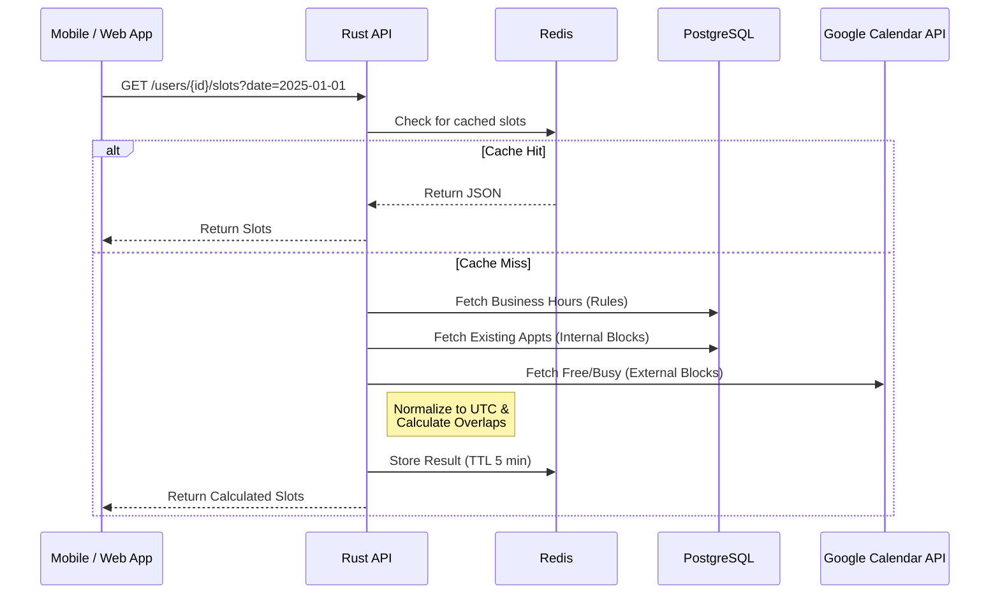
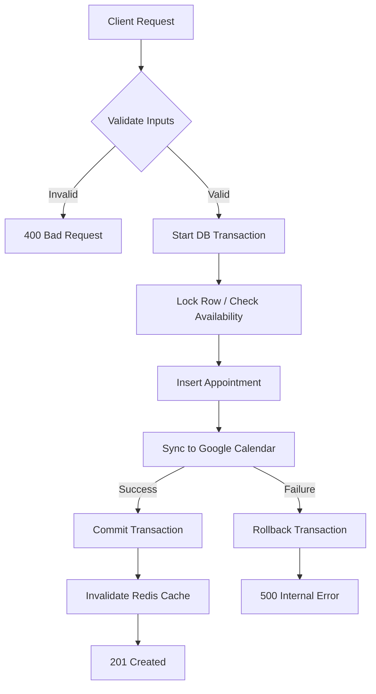

# 📅 Booking Headless API


> **A high-performance, headless appointment scheduling engine.**

This is a client-agnostic backend service designed to power scheduling for **Web, Mobile (iOS/Android), and Desktop** applications. By strictly decoupling business logic from the presentation layer, this API serves as a central, authoritative decision engine for time management across all your client platforms.

Built with **Rust** and **Actix-Web**, it features two-way Google Calendar synchronization, atomic database transactions, and a "Fail-Fast" configuration philosophy.

## 🏗 Architecture & Flow

This project follows a **Headless API** architecture. It exposes pure JSON endpoints via REST, allowing any consumer to integrate complex scheduling logic without reimplementing the math.

### 1. The Availability Engine

The core complexity lies in determining when a user is "free." The system aggregates data from multiple sources to serve a single source of truth to the client.

1.  **Business Rules:** Recurring opening hours defined in PostgreSQL.
2.  **External Conflicts:** Real-time "Free/Busy" checks against Google Calendar.
3.  **Internal Conflicts:** Existing appointments in the database.

The engine normalizes all times to UTC, calculates overlaps, and generates available slots.



### 2\. The Booking Transaction

To ensure data integrity, bookings are handled atomically. If the sync with Google Calendar fails, the database transaction rolls back, ensuring the system never enters an inconsistent state.



## ⚡ Key Features

### 🛡 Reliability & Safety

- **Fail-Fast Configuration:** The application validates all environment variables and connections at startup. It refuses to boot in a broken state.
- **Atomic Transactions:** Uses `sqlx` transactions to ensure bookings are all-or-nothing.
- **Type-Safe APIs:** Leveraging Rust's strong type system to prevent runtime errors.

### 🌍 Timezone Intelligence

- **Client Agnostic:** Stores everything in UTC. Clients receive ISO 8601 strings and render in the user's local time.
- **Complex Math:** Handles "Midnight Crossing" logic (e.g., shifts starting at 11 PM and ending 4 AM) using `chrono-tz` and `time`.

### 🚀 Performance

- **Connection Pooling:** Tuned `PgPool` for efficient database access.
- **Redis Caching:** Availability slots are cached to reduce latency and API quotas.
- **Zero-Cost Abstractions:** Uses pure Rust logic for slot generation, minimizing heap allocations.

### 🔌 Integrations

- **Google OAuth2:** Secure authentication flow.
- **Google Calendar:** Two-way sync (Free/Busy checks + Event creation).
- **Google Cloud Storage:** Signed URLs for secure, direct-to-bucket profile image uploads.

## 🛠 Tech Stack

| Component     | Technology | Description                                    |
| :------------ | :--------- | :--------------------------------------------- |
| **Language**  | Rust       | 2021 Edition                                   |
| **Framework** | Actix Web  | High-performance async web framework           |
| **Database**  | PostgreSQL | Reliability and relational data integrity      |
| **ORM/Query** | SQLx       | Async, compile-time checked SQL queries        |
| **Cache**     | Redis      | `deadpool-redis` for connection pooling        |
| **Docs**      | Utoipa     | Auto-generated OpenAPI (Swagger) documentation |
| **Runtime**   | Tokio      | Asynchronous runtime                           |

## 📚 API Documentation

When running locally, the interactive Swagger UI is available at:
`http://localhost:8080/swagger-ui/`

This provides a complete definition of all endpoints, request schemas, and response types.

## 🚀 Getting Started

### Prerequisites

- Rust (Latest Stable)
- Docker & Docker Compose
- Google Cloud Console Project (Credentials required)

### Installation

1.  **Clone the Repository**

     ```bash
    git clone https://github.com/onfranciis/booking-headless.git
    cd booking-headless
    ```

2.  **Environment Setup**
    Copy the example environment file and fill in your credentials.

    ```bash
    cp .env.example .env
    ```

3.  **Start Infrastructure**
    Spin up Postgres and Redis in the background.

    ```bash
    docker-compose up -d db redis
    ```

4.  **Run Migrations**
    Initialize the database schema.

    ```bash
    sqlx migrate run
    ```

5.  **Run the Server**

    ```bash
    cargo run
    ```

## 🧪 Testing

The project includes unit tests for pure logic (math) and integrations.

```bash
# Run logic tests (No DB required)
cargo test
```

## 🤝 Contributing

We welcome contributions from the community\! Whether it's updating docs or optimizing a query, your help is welcome.

👉 **[Read our Contributing Guide](./CONTRIBUTING.md)** for details on the architecture, testing strategy, and code of conduct.

## 📄 License

This project is licensed under the MIT License - see the [LICENSE](./LICENCE) file for details.
